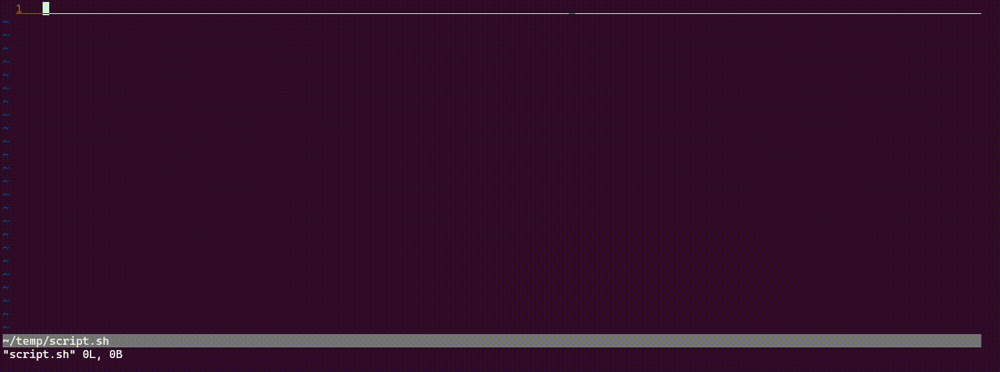

# snippets.vim

Vim integration of snippets - quick code bites with an easy copy-pasting workflow.



Search powered by [fzf.vim](https://github.com/junegunn/fzf.vim), [rg]() and [batcat]().

## Installation

This plugin requires you to have `fzf.vim` first, as well as `rg` to efficiently search your cards. For colored `fzf`-preview you'll also need `batcat`.

Install requisites:

```
sudo apt install fzf ripgrep
sudo apt install batcat  # optional
```

Using vim-plug:

```
Plug 'junegunn/fzf', { 'do': { -> fzf#install() } }
Plug 'junegunn/fzf.vim'
Plug 'pabsan-0/vim-snippets'
```

Set a custom path in your `.vimrc` where your snippets are to be stored and loaded from:

```
set g:snippets_directory = ~/cards  " custom path to store your notes
```

## Usage 

If unused, the plugin will set `<leader>s` as default entrypoint to the Snippets. 

In normal mode, this mapping will open a snippet search utility. You can also call it via the slower `:SnippetsRg` and `:SnippetsFzf`. 

At the search window:
- `tab`: alternate ripgrep and fzf (content / card name) search.
- `C-a`: **a**dd a new snippet.
- `C-t`: open snippet in a new **t**ab.
- `C-l`: open snippet in a new tab for **l**ater.
- `C-s`: open snippet in a new window **s**plit. Prompts for v/s afterwards.

In visual mode, this mapping will prompt you to select a directory a filename to create a new snippet, then a new buffer will be created at that location and your selection dumped into it.

## Features

### Managing your personal snippets 

You'll need a snippet collection to draw from, maybe under version control. Control it by setting this variable:

- `g:snippets_directory`: existing dir to look for and create new snippets into.

Find my collection at [pabsan-0/snippets](https://github.com/pabsan-0/snippets).

### Alternating search modes better

If you've configured `fzf` to store a search history, you can keep your query when alternating modes with `tab`. In order to do that, add the following lines to `.vimrc`.

```
let g:fzf_history_dir = '~/.local/share/fzf-history'

" Optional: Remap bindings to keep <c-p> and <c-n> as usual for up-down navigation
let $FZF_DEFAULT_OPTS = '--bind ctrl-n:down,ctrl-p:up,alt-n:next-history,alt-p:prev-history'
```
